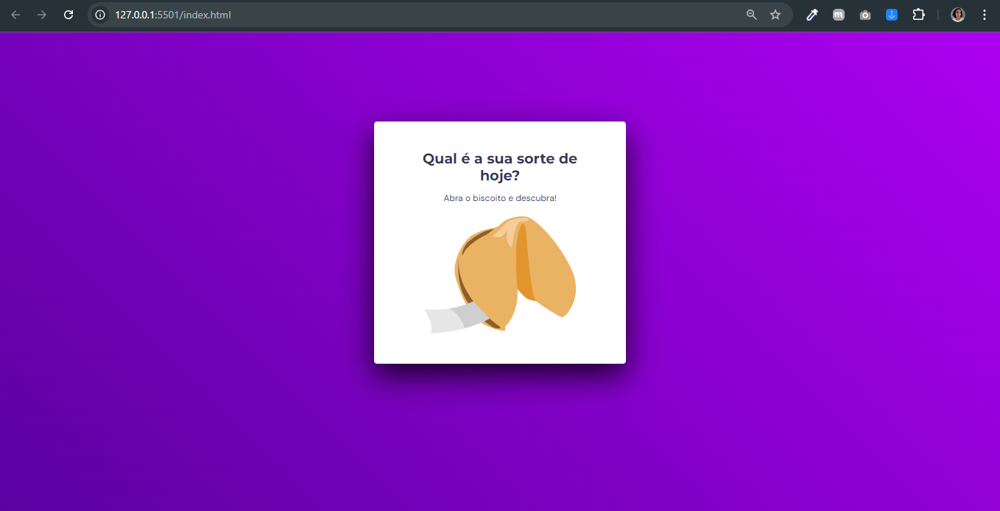
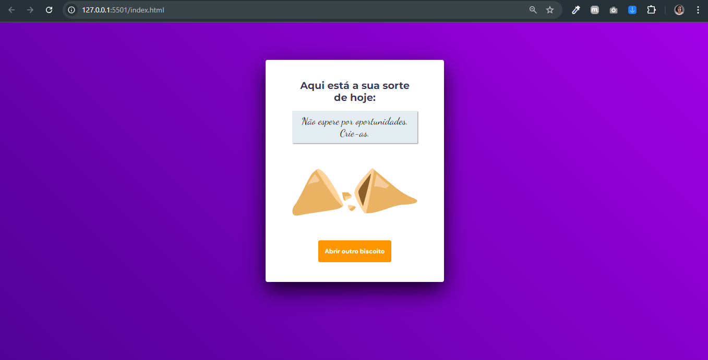

<h1 align="center" style="color: #E9967A">Biscoito da Sorte</h1>

Desafio 01: Biscoito da sorte

  <a href="#tecnologias" style="color: #FFA07A">Tecnologias</a>&nbsp;&nbsp;&nbsp;|&nbsp;&nbsp;&nbsp;
  <a href="#funcionalidades" style="color: #FFA07A">Funcionalidades</a>&nbsp;&nbsp;&nbsp;|&nbsp;&nbsp;&nbsp;
  <a href="#projeto" style="color: #FFA07A">Projeto</a>&nbsp;&nbsp;&nbsp;|&nbsp;&nbsp;&nbsp;
  <a href="#como-executar" style="color: #FFA07A">Como executar</a>&nbsp;&nbsp;&nbsp;|&nbsp;&nbsp;&nbsp;
  <a href="#licença" style="color: #FFA07A">Licença</a>

 

<h3 style="color: #E9967A">Visualização do Projeto</h3>

  

  

  

<h2 id="tecnologias" style="color: #CD853F">🚀 Tecnologias</h2>

Esse projeto foi desenvolvido com as seguintes tecnologias:

- HTML5
- CSS3
- JavaScript
- Fontes do Google (DM Sans, Dancing Script, Montserrat)

<h2 id="funcionalidades" style="color: #CD853F">✨ Funcionalidades</h2>

- Interface intuitiva com duas telas: inicial e de mensagem
- Animação de abertura do biscoito
- Exibição de mensagens da sorte aleatórias
- Opção para abrir um novo biscoito e receber outra mensagem

<h2 id="projeto" style="color: #CD853F">💻 Projeto</h2>

O Biscoito da Sorte é uma aplicação web interativa que simula a experiência de abrir um biscoito e receber uma mensagem da sorte. Os usuários podem clicar em um biscoito virtual para revelar uma mensagem aleatória e têm a opção de abrir um novo biscoito para receber outra mensagem.

<h2 id="como-executar" style="color: #CD853F">🔖 Como executar</h2>

1. Clone este repositório para sua máquina local
2. Abra o arquivo `index.html` em seu navegador
3. Clique no biscoito fechado para revelar sua mensagem de fortuna
4. Para obter uma nova mensagem, clique no botão "Abrir outro biscoito"

<h2 id="licença" style="color: #CD853F">📝 Licença</h2>

Esse projeto está sob a licença MIT.